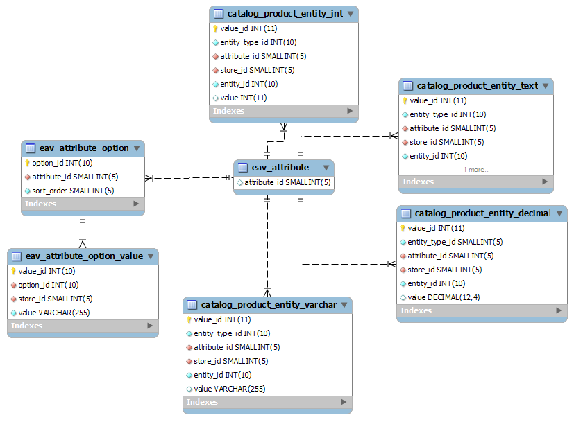

import { Head, Appear, Image } from 'mdx-deck'

import FullPageImage from './components/full-page-image'
import TwitterLink from './components/twitter-link'
import SyntaxHighlighter from './components/syntax-highlighter'
import useFullscreenKeys from './components/use-fullscreen-keys'

<Head>
    {useFullscreenKeys()}
    <title>MongoDB e PHP</title>
    <link rel="shortcut icon" href="/images/icon.png" />
    <meta property="og:title" content="MongoDB com PHP: pensando NoSQL" />
    <meta property="og:image" content="/images/cover.png" />
    <meta property="twitter:title" content="MongoDB com PHP: pensando NoSQL" />
    <meta property="twitter:card" content="summary_large_image" />
    <meta property="twitter:image" content="/images/cover.png" />
</Head>

<link href="https://fonts.googleapis.com/css?family=Lobster" rel="stylesheet" />


MongoDB e PHP:<br />
_o que você precisa saber para começar_

<br />

<TwitterLink href="https://twitter.com/ravanscafi">
    @ravanscafi
</TwitterLink>

---

<SyntaxHighlighter language='javascript'>
    {`db.users.findOne({name: "Ravan Scafi"})`}
</SyntaxHighlighter>

---

<SyntaxHighlighter language='javascript'>
{`{
	"name" : "Ravan Scafi",
    "blog" : "https://ravan.me",
    "company" : {
        "name": "Leroy Merlin",
        "role": "Backend Developer"
    }
	"communities" : [ "PHPSP", "LaravelSP" ]
}`}
</SyntaxHighlighter>

---

# :warning:

O conteúdo será só a ponta do Iceberg


---

<FullPageImage src="images/db-ranking.png" alt="DB-Engine Ranking" />

---

# MongoDB

<Appear>
<li style={{fontSize:'3rem'}}>NoSQL</li>
<li style={{fontSize:'3rem'}}>Schemaless</li>
<li style={{fontSize:'3rem'}}>Baseado em Documentos</li>
<li style={{fontSize:'3rem'}}>"JSON" (BSON)</li>
</Appear>

---

## Tá... mas o que isso quer dizer?

---

# Demo 👹

---

# MongoDB

- NoSQL
- Schemaless
- Baseado em Documentos
- "JSON" (BSON)

---

<FullPageImage src="images/leroy-home.jpg" alt="Leroy Merlin - Home" />

---

<FullPageImage src="images/leroy-furadeira.jpg" alt="Leroy Merlin - Furadeira" />

---

<FullPageImage src="images/leroy-cimento.jpg" alt="Leroy Merlin - Cimento" />

---

<FullPageImage src="images/leroy-churrasqueira.jpg" alt="Leroy Merlin - Churrasqueira" />

---

<FullPageImage src="images/leroy-almofada.jpg" alt="Leroy Merlin - Almofada" />

---

<FullPageImage src="images/leroy-palmeira.jpg" alt="Leroy Merlin - Palmeira" />

---

## E como modelar isso?

---


---

# Modelo EAV
### Entity-Attribute-Value

(é o modelo do Magento)

---



---

Campo JSON? Não existia.

---

### O MongoDB parecia uma boa opção...

---

<FullPageImage src="images/ext-mongodb.png" alt="PHP MongoDB Extension" />

---

<FullPageImage src="images/lib-mongodb.png" alt="PHP MongoDB Library" />

---

<SyntaxHighlighter language='php'>
{`$collection = (new MongoDB\\Client)->desenvolvimento->eventos;\n\n$result = $collection->insertOne([\n\t'nome' => 'PHPeste',\n\t'cidade' => 'Recife/PE',\n\t'local' => 'Uninabuco',\n]);\n\nprintf(\n\t"Foram inseridos %d documento(s)\\n",\n\t$result->getInsertedCount()\n);\nvar_dump($result->getInsertedId());`}
</SyntaxHighlighter>

---

```
Foram inseridos 1 documento(s)
object(MongoDB\\BSON\\ObjectId)#3104 (1) {
  ["oid"]=>
  string(24) "5dac3859ef8ec93060270173"
}
```

---

<SyntaxHighlighter language='php'>
{`$collection = (new MongoDB\\Client)->desenvolvimento->eventos;\n\n$document = $collection->findOne(['nome' => 'PHPeste']);\n\nvar_dump($document);`}
</SyntaxHighlighter>

---

```
object(MongoDB\\Model\\BSONDocument)#3086 (1) {
  ["storage":"ArrayObject":private]=>
  array(4) {
    ["_id"]=>
    object(MongoDB\\BSON\\ObjectId)#3087 (1) {
      ["oid"]=>
      string(24) "5dac3859ef8ec93060270173"
    }
    ["nome"]=>
    string(7) "PHPeste"
    ["cidade"]=>
    string(9) "Recife/PE"
    ["local"]=>
    string(9) "Uninabuco"
  }
}
```

---

# E como "pensar" no modelo MongoDB?

---

## Se você se aproveitar da natureza `Schemaless`, o controle dos dados deverá ser feito _na aplicação_.

---

## Pense em como você irá interagir com esses dados

---

## Relacionamentos são muitos importantes!

---

## Você tem duas opções: _Reference_ ou _Embed_

---

### O _reference_ é o mais simples:
Um `id` que referencia outra _collection_.

---

### Já o _embed_ é diferente.
Salvamos o documento "filho" dentro do documento "pai".

---

## Modelando um _blog_

---

- Posts
- Autores
- Comentários

---

- Um post tem um autor
- Um autor pode ter vários posts
- Um post pode ter vários comentários

---

### O autor existe `independentemente` dos posts

---

(portanto são _collections_ separadas)

---

### Se o post um morrer, os comentários `não tem mais uso`

---

(portanto os comentários podem estar _dentro_ do post)

---

### Modelando um Autor

---

<SyntaxHighlighter language='javascript'>
{`{
    "_id" : ObjectId("5d8ba3584bc1688665b19199"),
    "name" : "Ravan Scafi",
    "blog" : "https://ravan.me"
}`}
</SyntaxHighlighter>

---

### Modelando um Post
(ainda sem comentários)

---

<SyntaxHighlighter language='javascript'>
{`{
    "_id" : ObjectId("5d8ba3584bc1688665b19200"),
    "name" : "Como foi o PHPeste",
    "body" : "Foi bom demais!",
    "author_id" : ObjectId("5d8ba3584bc1688665b19199")
}`}
</SyntaxHighlighter>

---

### E os comentários?

---


<SyntaxHighlighter language='javascript'>
{`{
    "_id" : ObjectId("5d8ba3584bc1688665b19200"),
    "name" : "Como foi o PHPeste",
    "body" : "Foi bom demais!",
    "author_id" : ObjectId("5d8ba3584bc1688665b19199"),
    "comments" : [
        {
            "user_id" : ObjectId("5d8ba3584bc1688665b19456"),
            "comment" : "FIRST!"
        },
        {
            "user_id" : ObjectId("6e7553584bf2688665b1977a"),
            "comment" : "Evento irado!"
        }
    ]
}`}
</SyntaxHighlighter>

---

<div style={{fontFamily: 'Lobster, Georgia, serif', fontSize: '4.5rem', lineHeight: '4rem', marginBottom: '4rem'}}>
    To em<u>be</u>d<br />
    - or -<br />
    not to em<u>be</u>d?
</div>


---

### `Embed` é muito poderoso se usado corretamente!

---

### Legal! Mas um `ORM`, existe?

---

### Chamamos de `ODM`
_Object Document Mapper_

---

<FullPageImage src="images/doctrine-mongodb.png" alt="Doctrine MongoDB" />

---

<FullPageImage src="images/jenssegers-mongodb.png" alt="Jenssegers Laravel-MongoDB" />

---

As soluções existentes pra época

pareciam tentar encaixar o MongoDB

_no modelo relacional_

---


---

Então...

---

<FullPageImage src="images/mongolid.png" alt="Mongolid" />

---

<FullPageImage src="images/mongolid-laravel.png" alt="Mongolid Laravel" />

---

## Dicas

---

Como o controle fica na aplicação,<br />se outra aplicação escrever no banco,<br />terá que duplicar as regras

---

(o ideal é cada aplicação com seu próprio banco, conversando por APIs)

---

Para o pessoal de `BI`, o MongoDB oferece uma integração que "exporta" o banco como relacional (mas cuidado!)

---

O MongoDB evoluiu muito, com validações, "joins", transactions...

---

Outros bancos correram muito atrás de recursos do MongoDB

---

Avalie o uso, não existe bala de prata!

---

<FullPageImage src="images/devo-usar-mongodb.png" alt="Devo usar MongoDB e NoSQL?" />

---


## Recursos

- [Comparing Database Types: How Database Types Evolved to Meet Different Needs](https://www.prisma.io/blog/comparison-of-database-models-1iz9u29nwn37)
- [DB-Engines Ranking](https://db-engines.com/en/ranking)
- [Devo usar NoSQL e MongoDB?](https://medium.com/leroy-merlin-brasil-tech/devo-usar-nosql-e-mongodb-951693aa0d34)

---

## Onde ir a seguir?

- [Mongolid](https://github.com/leroy-merlin-br/mongolid/)
- [Mongolid Laravel](https://github.com/leroy-merlin-br/mongolid-laravel/)
- [MongoDB University](https://university.mongodb.com/)
- [Mongoose](https://mongoosejs.com/)
- [MongoDB Compass](https://www.mongodb.com/download-center/compass)

---

<FullPageImage src="images/university.png" alt="MongoDB University" />

---
<div style={{width: '100vw', height: '100vh', backgroundColor: '#f2f2f2', display: 'flex', alignItems: 'center', justifyContent: 'center', flexDirection: 'column', color: '#020202', padding: '.5rem'}}>


## Estamos Contratando!

[bit.ly/leroymerlin-backend](http://bit.ly/leroymerlin-backend)
</div>

---

<div style={{fontFamily: 'Lobster, Georgia, serif', fontSize: '8rem', marginBottom: '6rem'}}>
Dúvidas?
</div>

# :raising_hand:

---

<div style={{fontFamily: 'Lobster, Georgia, serif', fontSize: '8rem', marginBottom: '6rem'}}>
Obrigado!
</div>

<TwitterLink href="https://twitter.com/ravanscafi">
    @ravanscafi
</TwitterLink>

[bit.ly/leroymerlin-backend](http://bit.ly/leroymerlin-backend)
